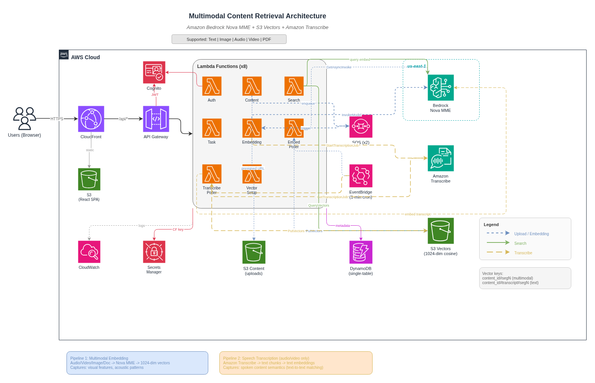

# Nova MME Demo — Multimodal Content Retrieval

**English** | [中文](README_CN.md)

A serverless AWS application for uploading and semantically searching multimodal content — text, images, audio, video, and documents — using a unified 1024-dimensional vector embedding space.

**Core technology stack**:
- [Amazon Bedrock Nova MME](https://docs.aws.amazon.com/bedrock/latest/userguide/titan-multimodal-embeddings.html) (`amazon.nova-2-multimodal-embeddings-v1:0`) — multimodal embeddings for all content types
- [Amazon S3 Vectors](https://aws.amazon.com/s3/features/vectors/) — vector storage and cosine similarity search
- [Amazon Transcribe](https://aws.amazon.com/transcribe/) — speech-to-text for audio/video, enabling text queries to find spoken content
- [AWS SAM](https://aws.amazon.com/serverless/sam/) — serverless infrastructure (Lambda, API Gateway, DynamoDB, SQS, EventBridge)
- React 18 + TypeScript frontend with AWS Amplify v6 authentication

## Architecture Overview

```
React SPA ──► CloudFront ──► API Gateway (Cognito auth) ──► Lambda functions
                                                              ├─ auth/              (Cognito register/profile)
                                                              ├─ content/           (presigned upload, confirm)
                                                              ├─ search/            (vector query, transcript search)
                                                              └─ task/              (status polling)

Upload flow:
  content Lambda ──► SQS ──► embedding Lambda ──► Bedrock Nova MME ──► S3 Vectors
                        │         └──► (audio/video) ──► Amazon Transcribe
                        │                                      └──► EventBridge 1-min ──► transcribe_poller Lambda
                        │                                                                      └──► S3 Vectors (transcript embeddings)
                        └──► (large files) ──► Bedrock async invoke
                                                      └──► EventBridge 1-min ──► embedding_poller Lambda
```

Full architecture: [docs/ARCHITECTURE.md](docs/ARCHITECTURE.md)



## Supported Formats

| Modality | Formats | Limit |
|----------|---------|-------|
| Image | PNG, JPEG, WEBP, GIF | 50 MB |
| Audio | MP3, WAV, OGG | 1 GB (≤ 2h) |
| Video | MP4, MOV, MKV, WEBM, FLV, MPEG, WMV, 3GP | 2 GB (≤ 2h) |
| Document | PDF, DOCX, TXT | 634 MB |
| Text | Direct input | 50,000 chars |

Audio/video >30s or >100MB → async Bedrock segmented embedding (polled every minute).
Audio/video → Amazon Transcribe speech-to-text; transcript chunks stored as searchable text vectors.

## Prerequisites

- **Python 3.12+**
- **Node.js 20+**
- **AWS CLI** configured with credentials (`aws configure`)
- **AWS SAM CLI** (`pip install aws-sam-cli` or [install guide](https://docs.aws.amazon.com/serverless-application-model/latest/developerguide/install-sam-cli.html))
- An **AWS account** with access to:
  - Amazon Bedrock Nova MME (request access in `us-east-1` console)
  - Amazon S3 Vectors
  - Amazon Transcribe

## Quick Start

### 1. Install dependencies

```bash
./scripts/setup-dev.sh
source .venv/bin/activate
```

### 2. Run tests

```bash
pytest backend/tests/ -v
pytest backend/tests/property/ -v  # Hypothesis property tests
```

### 3. Deploy backend

```bash
# First deploy (interactive — SAM will prompt for parameters)
sam build --parallel
sam deploy --guided
```

On first deploy, SAM will ask for:
- **Stack name** (e.g. `multimodal-retrieval-dev`)
- **AWS region** (recommend `us-west-2`; Bedrock calls always go to `us-east-1`)
- **Stage** (e.g. `dev`)
- **CloudFrontDomain** — leave blank on first deploy, fill in after CloudFront is created

After the first deploy, configure `samconfig.toml` from the example:

```bash
cp samconfig.toml.example samconfig.toml
# Edit samconfig.toml with your bucket name, region, and CloudFront domain
sam build --parallel && sam deploy
```

### 4. Configure and deploy frontend

```bash
# Copy env example and fill in values from CloudFormation outputs
cp frontend/.env.example frontend/.env.local

# Get values from your stack
aws cloudformation describe-stacks \
  --stack-name multimodal-retrieval-dev \
  --query 'Stacks[0].Outputs'
```

Edit `frontend/.env.local`:
```
VITE_API_URL=https://<your-cloudfront-domain>
VITE_USER_POOL_ID=<UserPoolId from outputs>
VITE_USER_POOL_CLIENT_ID=<UserPoolClientId from outputs>
VITE_AWS_REGION=<your-region>
VITE_CLOUDFRONT_DOMAIN=https://<your-cloudfront-domain>
```

Then deploy:
```bash
./scripts/deploy-frontend.sh dev
```

### 5. Local frontend development

```bash
cd frontend && npm run dev
```

## Project Structure

```
nova-mme-demo/
├── backend/
│   ├── functions/
│   │   ├── auth/               Cognito register/profile
│   │   ├── content/            Upload management, SQS enqueue
│   │   ├── embedding/          Bedrock sync embedding + Transcribe job start (SQS trigger)
│   │   ├── embedding_poller/   Async Bedrock job polling (EventBridge trigger)
│   │   ├── transcribe_poller/  Transcribe job polling, transcript chunking + embedding (EventBridge trigger)
│   │   ├── search/             Vector search (audio/video + transcript modalities)
│   │   ├── task/               Task status API
│   │   └── vector_setup/       S3 Vectors init (CloudFormation custom resource)
│   ├── layers/shared/python/shared/
│   │   ├── models.py           Data models, DynamoDB key helpers
│   │   ├── dynamodb.py         DynamoDB CRUD
│   │   ├── s3_client.py        S3 presigned URLs, S3 Vectors put/query
│   │   ├── bedrock_client.py   Nova MME sync/async embedding
│   │   └── logger.py           Structured JSON logging
│   └── tests/
│       ├── conftest.py         moto fixtures, make_api_event helper
│       ├── test_models.py
│       ├── test_dynamodb.py
│       ├── test_content_handler.py
│       ├── test_task_handler.py
│       └── property/
│           └── test_properties.py   Hypothesis property tests
├── frontend/src/
│   ├── pages/                  LoginPage, DashboardPage, UploadPage, SearchPage, TasksPage
│   ├── components/             FileUpload, SearchBox, ResultCard, MediaPreview, TaskList
│   ├── hooks/                  useAuth, useTasks
│   ├── services/               api.ts (Axios + IdToken), auth.ts (Amplify v6)
│   └── types/index.ts          All TypeScript interfaces
├── docs/
│   ├── ARCHITECTURE.md         Full system architecture
│   ├── API.md                  API endpoint reference
│   ├── CHANGELOG.md            Bug fixes and changes
│   └── KNOWN_ISSUES.md         Limitations and workarounds
├── template.yaml               AWS SAM template
├── samconfig.toml.example      SAM config template (copy to samconfig.toml)
└── scripts/
    ├── setup-dev.sh
    ├── deploy.sh
    └── deploy-frontend.sh
```

## API Overview

All endpoints require Cognito IdToken in the `Authorization` header (no "Bearer" prefix).

| Method | Path | Description |
|--------|------|-------------|
| POST | `/api/auth/register` | Create account |
| POST | `/api/auth/login` | Login, get tokens |
| GET | `/api/auth/me` | Get user profile |
| POST | `/api/content/request-upload` | Get S3 presigned upload URL |
| POST | `/api/content/confirm-upload` | Confirm upload, start embedding |
| POST | `/api/content/upload-text` | Upload text directly |
| GET | `/api/content` | List user's content |
| GET | `/api/content/{id}` | Get content metadata |
| DELETE | `/api/content/{id}` | Delete content |
| POST | `/api/search` | Semantic search |
| GET | `/api/tasks` | List embedding tasks |
| GET | `/api/tasks/{id}` | Get task details |

Full API reference: [docs/API.md](docs/API.md)

## Stack Outputs

After `sam deploy`, get your stack outputs:

```bash
aws cloudformation describe-stacks \
  --stack-name multimodal-retrieval-dev \
  --query 'Stacks[0].Outputs'
```

Key outputs: `ApiUrl`, `UserPoolId`, `UserPoolClientId`, `CloudFrontDomain`.

> **Note**: Bedrock Nova MME (`amazon.nova-2-multimodal-embeddings-v1:0`) is currently only available in `us-east-1`. The SAM template uses `us-east-1` for all Bedrock calls regardless of stack region.

## Known Issues

See [docs/KNOWN_ISSUES.md](docs/KNOWN_ISSUES.md) for current limitations and workarounds.

## License

MIT — see [LICENSE](LICENSE)
