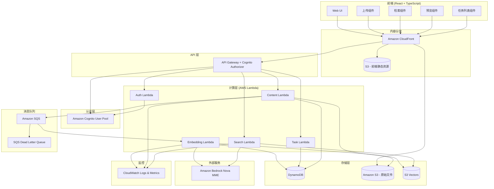
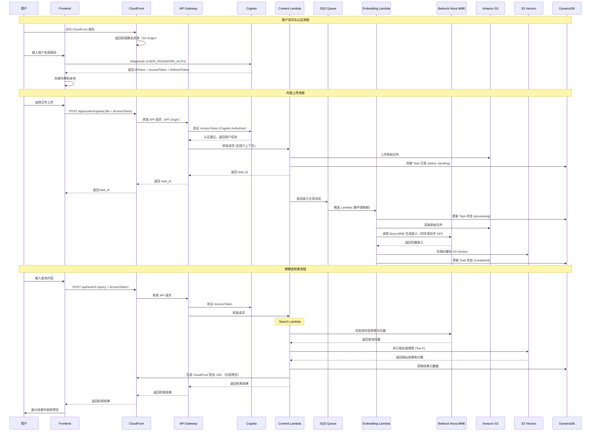

# 技术设计文档：多模态内容检索应用

## 概述

本系统是一个多模态内容检索应用，允许用户上传文本、语音、视频、文档、图片等多种模态内容，利用 Amazon Bedrock Nova MME 模型将内容直接转换为统一的向量嵌入空间，存储到 S3 向量数据库中，并支持跨模态语义检索。

### 核心设计决策

1. **Amazon Bedrock Nova MME 直接多模态嵌入**：使用 `amazon.nova-2-multimodal-embeddings-v1:0` 模型，原生支持多模态输入（文本、图片、视频、音频），无需对不同模态进行预处理或转换，直接将原始内容映射到统一的向量空间。支持同步 API（InvokeModel，适用于小文件）和异步 API（StartAsyncInvoke，适用于大文件自动分段嵌入）。
2. **全栈 AWS Serverless 架构**：采用 Lambda + API Gateway 替代传统服务器，SQS 替代 Celery + Redis 任务队列，实现完全无服务器化，按需扩展，降低运维成本。
3. **S3 Vector 向量存储**：使用 Amazon S3 Vectors 作为向量数据库，原生支持向量存储和相似度搜索，无需维护 FAISS 索引。原始文件也存储在 S3 中。
4. **Amazon Cognito 认证**：使用 Cognito User Pool 实现用户认证与授权，API Gateway 内置 Cognito Authorizer 进行令牌验证，无需自行管理密码存储和令牌签发。
5. **Amazon CloudFront 统一入口**：使用 CloudFront 作为用户访问的统一入口，分发前端静态资源（React SPA 部署到 S3），同时代理 API Gateway 请求，并用于生成内容预览的签名 URL。
6. **指数退避重试**：对 Bedrock API 调用实施指数退避重试策略，提升系统容错能力。

### 技术栈

| 层级 | 技术选型 | 说明 |
|------|---------|------|
| 前端 | React + TypeScript | SPA 应用，支持多模态内容预览 |
| CDN / 入口 | Amazon CloudFront | 静态资源分发、API 代理、签名 URL |
| API 网关 | Amazon API Gateway (REST) | 请求路由、Cognito 授权、限流 |
| 后端计算 | AWS Lambda (Python) | 无服务器函数，按需扩展 |
| 任务队列 | Amazon SQS | 异步任务处理和消息解耦 |
| 嵌入模型 | Amazon Bedrock Nova MME | 多模态向量嵌入生成 |
| 向量存储 | Amazon S3 Vectors | 向量存储与相似度搜索 |
| 对象存储 | Amazon S3 | 原始文件存储 |
| 数据库 | Amazon DynamoDB | 任务、内容元数据存储 |
| 认证 | Amazon Cognito | 用户认证与授权 |
| 日志监控 | Amazon CloudWatch | 日志记录与监控告警 |

## 架构

### 系统架构图




### 请求流程




## 组件与接口

### 1. Auth Service（认证服务 — Cognito 集成）

基于 Amazon Cognito User Pool 实现用户注册、登录、令牌管理。Auth Lambda 作为 Cognito 的薄封装层，处理注册和用户资料查询。API Gateway 使用 Cognito Authorizer 自动验证令牌。

**Cognito User Pool 配置：**
- 登录属性：username + password
- 必填属性：email
- 密码策略：最少 8 位，包含大小写字母、数字和特殊字符
- 令牌有效期：Access Token 24 小时，Refresh Token 30 天
- 认证流程：`USER_PASSWORD_AUTH`

**接口定义：**

```python
# POST /api/auth/register
# Auth Lambda 调用 Cognito AdminCreateUser 或 SignUp API
class RegisterRequest:
    username: str
    password: str
    email: str

class RegisterResponse:
    user_id: str  # Cognito sub
    username: str

# POST /api/auth/login
# 前端直接调用 Cognito InitiateAuth，或通过 Auth Lambda 代理
class LoginRequest:
    username: str
    password: str

class LoginResponse:
    id_token: str
    access_token: str
    refresh_token: str
    expires_in: int  # 秒

# GET /api/auth/me
# API Gateway Cognito Authorizer 自动验证令牌
# Auth Lambda 从 Cognito 获取用户属性
class UserProfile:
    user_id: str  # Cognito sub
    username: str
    email: str
```

**设计要点：**
- 密码由 Cognito 使用 SRP 协议安全存储，无需自行管理密码哈希
- API Gateway Cognito Authorizer 自动验证 Access Token，无需在 Lambda 中手动验证
- 令牌过期后，前端使用 Refresh Token 自动刷新，或引导用户重新登录
- Lambda 通过 `event['requestContext']['authorizer']['claims']` 获取用户信息

### 2. Content Service（内容服务 — Content Lambda）

负责文件上传、模态识别、任务创建。作为 Lambda 函数运行，通过 API Gateway 触发。

**接口定义：**

```python
# POST /api/content/upload
# Content-Type: multipart/form-data (通过 API Gateway Binary Media Types 支持)
# Authorization: Bearer <access_token> (Cognito Authorizer 自动验证)

class UploadResponse:
    task_id: str
    content_id: str
    modality: str
    status: str  # "pending"

# POST /api/content/upload-text
class TextUploadRequest:
    text: str
    title: str  # 可选

class TextUploadResponse:
    task_id: str
    content_id: str
    modality: str  # "text"
    status: str

# GET /api/content/{content_id}
class ContentDetail:
    content_id: str
    user_id: str
    modality: str
    filename: str
    file_size: int
    mime_type: str
    s3_key: str
    s3_bucket: str
    created_at: str  # ISO 8601
    metadata: dict

# GET /api/content/{content_id}/download
# 响应: 重定向到 CloudFront 签名 URL
```

**模态识别逻辑：**

| MIME 类型 | 模态 |
|----------|------|
| `image/png`, `image/jpeg`, `image/webp`, `image/gif` | image |
| `audio/mpeg`, `audio/wav`, `audio/ogg` | audio |
| `video/mp4`, `video/quicktime`, `video/x-matroska`, `video/webm`, `video/x-flv`, `video/mpeg`, `video/x-ms-wmv`, `video/3gpp` | video |
| `application/pdf`, `application/vnd.openxmlformats-officedocument.wordprocessingml.document`, `text/plain` | document |

**文件大小限制（基于 Nova MME 异步 API 限制）：**
- 图片：最大 50MB
- 语音：最大 1GB，最长 2 小时
- 视频：最大 2GB，最长 2 小时
- 文档（文本文件）：最大 634MB
- 文本输入：最大 50,000 字符

> 注意：API Gateway 有效载荷限制为 10MB。对于大文件（>10MB），Content Lambda 先生成 S3 预签名上传 URL，前端直接上传到 S3，然后通知 Lambda 完成后续处理。

### 3. Embedding Service（嵌入服务 — Embedding Lambda）

负责调用 Bedrock Nova MME 模型生成向量嵌入。由 SQS 事件源映射触发，异步运行。

**SQS 消息格式：**

```python
class EmbeddingMessage:
    content_id: str
    s3_key: str
    s3_bucket: str
    modality: str
    task_id: str
    user_id: str
    retry_count: int  # 当前重试次数，默认 0
```

**Lambda 处理逻辑：**

```python
class EmbeddingResult:
    content_id: str
    embedding_vector: list[float]  # 1024 维向量
    model_id: str
    processing_time_ms: int
```

**Bedrock Nova MME 调用方式：**

Nova MME 模型 ID：`amazon.nova-2-multimodal-embeddings-v1:0`

Embedding Lambda 根据文件大小和时长自动选择同步或异步 API：
- **同步 API（InvokeModel）**：适用于小文件（图片 ≤ 25MB 内联 / ≤ 50MB S3，音频/视频 ≤ 30 秒且 ≤ 100MB S3）
- **异步 API（StartAsyncInvoke）**：适用于大文件，支持自动分段嵌入

```python
# 同步 API - 文本输入（单次嵌入）
bedrock_client.invoke_model(
    modelId="amazon.nova-2-multimodal-embeddings-v1:0",
    body={
        "taskType": "RETRIEVAL",
        "singleEmbeddingParams": {
            "inputText": "文本内容",
            "embeddingConfig": {"outputEmbeddingLength": 1024}
        }
    }
)

# 同步 API - 图片输入（base64 内联，≤ 25MB）
bedrock_client.invoke_model(
    modelId="amazon.nova-2-multimodal-embeddings-v1:0",
    body={
        "taskType": "RETRIEVAL",
        "singleEmbeddingParams": {
            "inputImage": {
                "inlineData": base64_encoded_image
            },
            "embeddingConfig": {"outputEmbeddingLength": 1024}
        }
    }
)

# 同步 API - 图片/音频/视频通过 S3 URI
bedrock_client.invoke_model(
    modelId="amazon.nova-2-multimodal-embeddings-v1:0",
    body={
        "taskType": "RETRIEVAL",
        "singleEmbeddingParams": {
            "inputVideo": {  # 或 inputImage / inputAudio
                "s3Uri": "s3://bucket/key"
            },
            "embeddingConfig": {"outputEmbeddingLength": 1024}
        }
    }
)

# 异步 API - 大文件分段嵌入（音频/视频 > 30秒，或大文本）
bedrock_client.start_async_invoke(
    modelId="amazon.nova-2-multimodal-embeddings-v1:0",
    modelInput={
        "taskType": "RETRIEVAL",
        "segmentedEmbeddingParams": {
            "inputVideo": {
                "s3Uri": "s3://bucket/key"
            },
            "embeddingConfig": {
                "outputEmbeddingLength": 1024
            },
            "segmentConfig": {
                "durationSeconds": 10  # 视频/音频分段时长（1-30，默认 5）
            },
            "videoEmbeddingMode": "AUDIO_VIDEO_COMBINED"  # 或 AUDIO_VIDEO_SEPARATE
        }
    },
    outputDataConfig={
        "s3OutputDataConfig": {
            "s3Uri": "s3://output-bucket/embeddings/"
        }
    }
)

# 异步 API - 大文本分段嵌入
bedrock_client.start_async_invoke(
    modelId="amazon.nova-2-multimodal-embeddings-v1:0",
    modelInput={
        "taskType": "RETRIEVAL",
        "segmentedEmbeddingParams": {
            "inputText": {
                "s3Uri": "s3://bucket/text-file.txt"
            },
            "embeddingConfig": {
                "outputEmbeddingLength": 1024
            },
            "segmentConfig": {
                "maxLengthChars": 32000  # 文本分段长度（800-50000，默认 32000）
            }
        }
    },
    outputDataConfig={
        "s3OutputDataConfig": {
            "s3Uri": "s3://output-bucket/embeddings/"
        }
    }
)
```

**同步/异步 API 选择逻辑：**

| 模态 | 同步 API 条件 | 异步 API 条件 |
|------|-------------|-------------|
| 文本 | ≤ 50,000 字符 | > 50,000 字符（通过 S3 文件） |
| 图片 | 所有图片（≤ 50MB） | 不适用 |
| 音频 | ≤ 30 秒且 ≤ 100MB | > 30 秒或 > 100MB |
| 视频 | ≤ 30 秒且 ≤ 100MB | > 30 秒或 > 100MB |

**SQS 配置：**
- 可见性超时：900 秒（匹配 Lambda 最大执行时间 15 分钟，异步 API 大文件处理需要更长时间）
- 消息保留期：14 天
- 最大接收次数：4（1 次初始 + 3 次重试）
- 死信队列（DLQ）：超过最大接收次数后转入 DLQ
- 批处理大小：1（每次处理一条消息，避免超时）

**重试策略：**
- SQS 自动重试：消息处理失败后自动重新投递
- Lambda 内部重试：对 Bedrock API 调用实施指数退避
  - 最大重试次数：3
  - 退避策略：指数退避，初始间隔 1 秒，退避因子 2（1s, 2s, 4s）
  - 可重试错误：`ThrottlingException`、`ServiceUnavailableException`、网络超时
- 最终失败：消息转入 DLQ，Task 标记为 failed

### 4. Search Service（检索服务 — Search Lambda）

负责将查询内容转换为向量并在 S3 Vectors 中执行相似度搜索。

**接口定义：**

```python
# POST /api/search
# Authorization: Bearer <access_token>
class SearchRequest:
    query_text: str  # 文本查询（与 query_file 二选一）
    query_file: bytes  # 文件查询（与 query_text 二选一，base64 编码）
    query_file_type: str  # 文件 MIME 类型
    top_k: int  # 默认 10，范围 1-100
    modality_filter: list[str]  # 可选，按模态过滤结果

class SearchResult:
    content_id: str
    similarity_score: float
    modality: str
    filename: str
    file_size: int
    preview_url: str  # CloudFront 签名 URL
    created_at: str
    metadata: dict

class SearchResponse:
    query_id: str
    results: list[SearchResult]
    total_count: int
    top_k: int
    processing_time_ms: int
```

**S3 Vectors 相似度搜索：**
- 使用 S3 Vectors `query_vectors` API 执行相似度搜索
- 向量维度：1024（Nova MME 输出维度）
- 距离度量：cosine similarity
- 结果按相似度分数降序排列

### 5. Task Service（任务服务 — Task Lambda）

负责任务状态管理和查询。

**接口定义：**

```python
# GET /api/tasks
# Authorization: Bearer <access_token>
# 查询参数: status (可选), page, page_size, sort_by, sort_order
class TaskListResponse:
    tasks: list[TaskSummary]
    total: int
    page: int
    page_size: int

class TaskSummary:
    task_id: str
    task_type: str  # "upload" | "search"
    modality: str
    status: str  # "pending" | "processing" | "completed" | "failed"
    created_at: str
    updated_at: str
    result_summary: str  # 可选

# GET /api/tasks/{task_id}
class TaskDetail(TaskSummary):
    content_id: str  # 可选
    error_message: str  # 可选
    processing_time_ms: int  # 可选
```


## 数据模型

### DynamoDB 表设计

本系统使用 DynamoDB 单表设计（Single Table Design），通过分区键（PK）和排序键（SK）的组合支持多种访问模式。

#### 表结构：`MultimodalContentTable`

| 属性 | 类型 | 说明 |
|------|------|------|
| PK | String | 分区键，格式见下方访问模式 |
| SK | String | 排序键，格式见下方访问模式 |
| GSI1PK | String | GSI1 分区键 |
| GSI1SK | String | GSI1 排序键 |
| entity_type | String | 实体类型：USER / CONTENT / TASK / EMBEDDING |
| data | Map | 实体具体属性 |

#### 实体与键设计

**User 实体：**
| 键 | 值 | 说明 |
|----|-----|------|
| PK | `USER#{user_id}` | Cognito sub |
| SK | `PROFILE` | 固定值 |
| data | `{username, email, created_at}` | 用户基本信息 |

**Content 实体：**
| 键 | 值 | 说明 |
|----|-----|------|
| PK | `USER#{user_id}` | 所属用户 |
| SK | `CONTENT#{content_id}` | 内容 ID |
| GSI1PK | `CONTENT#{content_id}` | 用于按 content_id 直接查询 |
| GSI1SK | `METADATA` | 固定值 |
| data | `{modality, filename, file_size, mime_type, s3_key, s3_bucket, is_indexed, created_at}` | 内容元数据 |

**Task 实体：**
| 键 | 值 | 说明 |
|----|-----|------|
| PK | `USER#{user_id}` | 所属用户 |
| SK | `TASK#{created_at}#{task_id}` | 按创建时间排序 |
| GSI1PK | `TASK#{task_id}` | 用于按 task_id 直接查询 |
| GSI1SK | `DETAIL` | 固定值 |
| data | `{task_type, modality, status, content_id, error_message, processing_time_ms, result_summary, created_at, updated_at}` | 任务详情 |

**Embedding 实体：**
| 键 | 值 | 说明 |
|----|-----|------|
| PK | `CONTENT#{content_id}` | 关联内容 |
| SK | `EMBEDDING` | 固定值 |
| data | `{model_id, vector_dimension, s3_vectors_key, created_at}` | 嵌入元数据 |

#### GSI（全局二级索引）

**GSI1：** 支持按 content_id 或 task_id 直接查询
- 分区键：GSI1PK
- 排序键：GSI1SK

#### 访问模式

| 访问模式 | 键条件 | 说明 |
|---------|--------|------|
| 获取用户资料 | PK=`USER#{user_id}`, SK=`PROFILE` | 单项查询 |
| 获取用户所有内容 | PK=`USER#{user_id}`, SK begins_with `CONTENT#` | 查询用户上传的所有内容 |
| 获取用户所有任务 | PK=`USER#{user_id}`, SK begins_with `TASK#` | 按时间排序的任务列表 |
| 按 task_id 查询任务 | GSI1PK=`TASK#{task_id}` | 通过 GSI1 查询 |
| 按 content_id 查询内容 | GSI1PK=`CONTENT#{content_id}` | 通过 GSI1 查询 |
| 获取内容的嵌入信息 | PK=`CONTENT#{content_id}`, SK=`EMBEDDING` | 单项查询 |
| 按状态筛选任务 | PK=`USER#{user_id}`, SK begins_with `TASK#`, filter status | 查询后过滤 |

#### DynamoDB 数据模型示例

```python
# Content 实体示例
content_item = {
    "PK": {"S": "USER#a1b2c3d4"},
    "SK": {"S": "CONTENT#e5f6g7h8"},
    "GSI1PK": {"S": "CONTENT#e5f6g7h8"},
    "GSI1SK": {"S": "METADATA"},
    "entity_type": {"S": "CONTENT"},
    "data": {"M": {
        "modality": {"S": "image"},
        "filename": {"S": "photo.jpg"},
        "file_size": {"N": "2048576"},
        "mime_type": {"S": "image/jpeg"},
        "s3_key": {"S": "uploads/a1b2c3d4/e5f6g7h8/photo.jpg"},
        "s3_bucket": {"S": "multimodal-content-bucket"},
        "is_indexed": {"BOOL": False},
        "created_at": {"S": "2024-01-15T10:30:00Z"}
    }}
}

# Task 实体示例
task_item = {
    "PK": {"S": "USER#a1b2c3d4"},
    "SK": {"S": "TASK#2024-01-15T10:30:00Z#t1a2b3c4"},
    "GSI1PK": {"S": "TASK#t1a2b3c4"},
    "GSI1SK": {"S": "DETAIL"},
    "entity_type": {"S": "TASK"},
    "data": {"M": {
        "task_type": {"S": "upload"},
        "modality": {"S": "image"},
        "status": {"S": "pending"},
        "content_id": {"S": "e5f6g7h8"},
        "created_at": {"S": "2024-01-15T10:30:00Z"},
        "updated_at": {"S": "2024-01-15T10:30:00Z"}
    }}
}
```

### S3 存储结构

```
s3://multimodal-content-bucket/
├── uploads/                    # 原始上传文件
│   └── {user_id}/
│       └── {content_id}/{filename}
├── embeddings-output/          # 异步 API 嵌入输出
│   └── {content_id}/
│       └── output.json

s3://multimodal-frontend-bucket/        # 前端静态资源（CloudFront Origin）
├── index.html
├── static/
│   ├── js/
│   └── css/
```

### CloudFront 配置

- **分发域名**：用户通过 CloudFront 域名访问整个应用
- **Origin 1 - 前端静态资源**：S3 桶 `multimodal-frontend-bucket`，使用 OAC（Origin Access Control）限制直接访问
- **Origin 2 - API 代理**：API Gateway 端点，路径模式 `/api/*` 转发到 API Gateway
- **Origin 3 - 内容预览**：S3 桶 `multimodal-content-bucket`，用于生成签名 URL 提供内容预览和下载
- **默认行为**：指向前端 S3 Origin，支持 SPA 路由（错误页面重定向到 index.html）
- **API 行为**：路径 `/api/*` 转发到 API Gateway Origin，禁用缓存，转发所有请求头和 Cookie
- **签名 URL**：Search Lambda 生成 CloudFront 签名 URL 用于内容预览，有效期 1 小时

### S3 Vectors 配置

- **向量桶名称**：`multimodal-vectors`
- **向量维度**：1024（Nova MME 输出维度）
- **距离度量**：cosine similarity
- **元数据字段**：content_id, user_id, modality, filename, created_at

S3 Vectors 是 Amazon S3 的原生向量存储功能，支持：
- `put_vectors`：存储向量嵌入及关联元数据
- `query_vectors`：基于向量相似度执行 Top-K 搜索
- `get_vectors`：按键检索特定向量
- `delete_vectors`：删除向量

无需维护独立的索引文件或快照，S3 Vectors 自动管理索引和持久化。


## 正确性属性

*属性是在系统所有有效执行中都应保持为真的特征或行为——本质上是关于系统应该做什么的形式化陈述。属性是人类可读规范与机器可验证正确性保证之间的桥梁。*

### Property 1: 未认证请求被拒绝

*For any* API 请求，如果请求未携带有效的 Cognito Access Token（缺失、过期或无效），则 API Gateway Cognito Authorizer 应返回 401 状态码，拒绝访问受保护的端点。

**Validates: Requirements 1.1, 1.5**

### Property 2: 有效凭据认证往返

*For any* 有效的用户名和密码组合，通过 Cognito 注册后使用相同凭据调用 InitiateAuth，应返回包含 id_token、access_token 和 refresh_token 的认证响应，且 access_token 可被 API Gateway Cognito Authorizer 成功验证。

**Validates: Requirements 1.2**

### Property 3: 无效凭据被拒绝

*For any* 无效的凭据（错误密码或不存在的用户名），Cognito InitiateAuth 应返回 NotAuthorizedException 错误，且响应中不包含认证令牌。

**Validates: Requirements 1.3**

### Property 4: 文件模态正确识别

*For any* 支持的文件 MIME 类型，系统的模态识别函数应返回正确的模态分类（image、audio、video、document、text）。

**Validates: Requirements 2.2**

### Property 5: 上传创建任务

*For any* 有效的上传请求（支持的文件格式且未超过大小限制），Content Lambda 应在 DynamoDB 中创建 Task 记录和 Content 记录，返回有效的 task_id，且 DynamoDB 中存在对应的记录。

**Validates: Requirements 2.4**

### Property 6: 文件格式验证

*For any* 文件上传请求，如果文件的 MIME 类型在支持列表中，则上传应被接受；如果不在支持列表中，则应返回错误信息并列出支持的格式。

**Validates: Requirements 2.5, 2.6**

### Property 7: 文件大小限制

*For any* 文件上传请求，如果文件大小超过该模态的大小限制，系统应拒绝上传并返回包含大小限制信息的错误消息。

**Validates: Requirements 2.7**

### Property 8: 嵌入生成与存储往返

*For any* 成功上传的内容，Embedding Lambda 应调用 Nova MME 模型生成向量嵌入，将嵌入存储到 S3 Vectors 中，且通过 content_id 可以从 S3 Vectors 检索到对应的嵌入向量，同时 DynamoDB 中的元数据包含原始文件的 S3 路径。

**Validates: Requirements 3.1, 3.2, 3.3, 3.4**

### Property 9: 嵌入失败标记任务

*For any* 嵌入生成过程中发生的错误（包括 Lambda 内部重试 3 次后仍失败，以及 SQS 消息最终转入 DLQ 的情况），系统应将对应的 Task 状态标记为 "failed"，且 error_message 字段非空。

**Validates: Requirements 3.5, 7.2**

### Property 10: 检索结果正确性

*For any* 检索请求和指定的 Top-K 值，返回的结果数量应 <= K，结果应按相似度分数严格降序排列，且每个结果应包含 content_id、similarity_score、modality、filename、preview_url 和 created_at 字段。

**Validates: Requirements 4.3, 4.4, 4.5, 4.6**

### Property 11: 任务用户隔离

*For any* 用户查询任务列表，DynamoDB 查询使用 PK=`USER#{user_id}` 作为分区键，返回的所有任务应仅属于该用户，不包含其他用户的任务。

**Validates: Requirements 5.1**

### Property 12: 任务数据完整性

*For any* Task 记录，其 status 字段应为 "pending"、"processing"、"completed"、"failed" 四种有效状态之一，且应包含 task_type、modality、created_at、status 字段。已完成的任务应包含 result_summary。

**Validates: Requirements 5.2, 5.4, 5.6**

### Property 13: 任务状态变更时间戳

*For any* Task 状态变更操作，变更后的 updated_at 时间戳应大于等于变更前的 updated_at 值。

**Validates: Requirements 5.3**

### Property 14: 任务状态筛选

*For any* 状态筛选条件，返回的任务列表中所有任务的 status 字段应与筛选条件匹配。

**Validates: Requirements 5.5**

### Property 15: 内容下载 URL 有效性

*For any* 已索引的内容，下载端点应返回有效的 CloudFront 签名 URL，该 URL 指向正确的原始文件。

**Validates: Requirements 6.7**

### Property 16: 重试与指数退避

*For any* Bedrock API 调用失败，Embedding Lambda 应自动重试最多 3 次，且重试间隔应遵循指数退避策略（每次间隔 >= 前一次间隔的 2 倍）。

**Validates: Requirements 7.1**

### Property 17: S3 Vectors 不可用时的降级处理

*For any* S3 Vectors 不可用的情况，嵌入数据应被写入 SQS 死信队列而非丢失，待 S3 Vectors 恢复后可从 DLQ 中重新处理。

**Validates: Requirements 7.4**

### Property 18: 错误日志完整性

*For any* 系统错误，CloudWatch 错误日志应包含时间戳、错误类型和请求上下文信息（包括 request_id、user_id、Lambda 函数名）三个必要字段。

**Validates: Requirements 7.5**

### Property 19: 错误响应安全性

*For any* 服务端错误（5xx），API Gateway 返回给客户端的错误响应不应包含堆栈跟踪、内部错误详情或敏感的技术信息。

**Validates: Requirements 7.6**

### Property 20: 任务隔离性

*For any* 两个不同用户同时提交的任务（通过不同的 SQS 消息独立处理），一个 Lambda 实例的处理失败不应导致另一个 Lambda 实例的任务失败或状态异常。

**Validates: Requirements 8.3**

### Property 21: API 速率限制

*For any* 时间窗口内的 Bedrock API 调用，Embedding Lambda 中的调用次数不应超过配置的速率限制阈值。

**Validates: Requirements 8.4**


## 错误处理

### 错误分类与处理策略

| 错误类别 | 示例 | 处理策略 | HTTP 状态码 |
|---------|------|---------|------------|
| 认证错误 | Cognito 令牌过期、无效令牌 | API Gateway Cognito Authorizer 自动拒绝，返回 401 | 401 |
| 输入验证错误 | 不支持的文件格式、文件过大 | Lambda 返回详细的验证错误信息 | 400 |
| 资源未找到 | 任务不存在、内容不存在 | Lambda 查询 DynamoDB 无结果，返回 404 | 404 |
| 权限错误 | 访问其他用户的任务 | Lambda 校验 PK 中的 user_id 与请求者不匹配 | 403 |
| 外部服务错误 | Bedrock API 失败 | Lambda 内部指数退避重试，最终失败则消息转入 SQS DLQ | 502 |
| 存储服务错误 | S3 不可用、S3 Vectors 不可用 | 消息保留在 SQS 中等待重试，最终转入 DLQ | 503 |
| Lambda 超时 | 嵌入生成超过 Lambda 最大执行时间 | SQS 可见性超时后自动重新投递消息 | 504 |
| 内部错误 | 未预期的异常 | CloudWatch 记录日志，API Gateway 返回通用错误信息 | 500 |

### 错误响应格式

```python
class ErrorResponse:
    error_code: str       # 机器可读的错误代码，如 "INVALID_FILE_FORMAT"
    message: str          # 用户友好的错误描述
    details: dict | None  # 可选的额外信息（如支持的格式列表）
    request_id: str       # API Gateway 请求 ID，用于追踪
```

### 重试策略详细设计

**Lambda 内部重试（Bedrock API 调用）：**

```python
class RetryConfig:
    max_retries: int = 3
    initial_delay_seconds: float = 1.0
    backoff_factor: float = 2.0
    max_delay_seconds: float = 30.0
    retryable_exceptions: list = [
        "ThrottlingException",
        "ServiceUnavailableException",
        "ConnectionError",
        "TimeoutError"
    ]
```

重试流程：
1. 第 1 次重试：等待 1 秒
2. 第 2 次重试：等待 2 秒
3. 第 3 次重试：等待 4 秒
4. 3 次重试后仍失败：Lambda 抛出异常，SQS 消息变为可见并重新投递

**SQS 级别重试：**
- SQS 可见性超时：900 秒（匹配 Lambda 最大执行时间 15 分钟）
- 最大接收次数：4（含首次处理）
- 超过最大接收次数后，消息自动转入死信队列（DLQ）
- DLQ 消息保留期：14 天，支持手动或自动重新处理

### 降级策略

- **S3 Vectors 不可用**：Embedding Lambda 处理失败，消息留在 SQS 中等待重试，最终转入 DLQ。可配置 CloudWatch 告警监控 DLQ 深度，恢复后通过 Lambda 批量重新处理 DLQ 消息。
- **S3 上传失败**：Content Lambda 返回错误给用户，建议稍后重试。大文件使用 S3 分段上传支持断点续传。
- **Bedrock 异步 API 超时**：异步嵌入任务通过轮询 `GetAsyncInvoke` 检查状态，超时后标记 Task 为 failed，消息转入 DLQ。
- **Bedrock API 限流**：Lambda 内部指数退避重试。SQS 天然支持流量削峰，消息在队列中等待处理。
- **DynamoDB 限流**：使用 DynamoDB 按需容量模式（On-Demand），自动适应流量变化。Lambda 中使用 AWS SDK 内置的重试机制。

## 测试策略

### 双重测试方法

本项目采用单元测试和属性测试相结合的双重测试策略：

- **单元测试**：验证特定示例、边界情况和错误条件
- **属性测试**：验证跨所有输入的通用属性

两者互补，共同提供全面的测试覆盖。

### 属性测试配置

- **测试库**：Python `hypothesis` 库
- **最小迭代次数**：每个属性测试至少 100 次迭代
- **标签格式**：`Feature: multimodal-content-retrieval, Property {number}: {property_text}`
- **每个正确性属性由一个属性测试实现**

### Serverless 测试策略

由于采用 AWS Serverless 架构，测试策略需要适配：

**本地测试：**
- 使用 `moto` 库模拟 AWS 服务（DynamoDB、S3、SQS、Cognito）
- Lambda 函数的 handler 逻辑可直接在本地调用测试
- 业务逻辑与 AWS SDK 调用分离，便于单元测试

**集成测试：**
- 使用 AWS SAM Local 或 LocalStack 进行本地集成测试
- 对 Bedrock API 使用 mock，避免产生费用
- DynamoDB Local 用于数据模型验证

### 单元测试范围

| 测试类别 | 覆盖内容 |
|---------|---------|
| 认证测试 | Cognito 注册/登录流程（moto mock）、令牌验证、过期处理 |
| 上传测试 | 文件格式验证（含 Nova MME 支持的所有格式）、大小限制（基于异步 API 限制）、模态识别、DynamoDB 记录创建 |
| 嵌入测试 | Bedrock 同步/异步 API 调用（mock）、API 选择逻辑、S3 Vectors 存储、SQS 消息处理、异步任务状态轮询 |
| 检索测试 | 相似度搜索（mock S3 Vectors）、结果排序、Top-K 限制 |
| 任务测试 | DynamoDB 状态流转、用户隔离（PK 分区）、筛选过滤 |
| 错误处理测试 | 重试逻辑、DLQ 降级、错误响应格式、CloudWatch 日志格式 |

### 属性测试范围

每个设计文档中的正确性属性（Property 1-21）对应一个属性测试。关键属性测试示例：

```python
from hypothesis import given, strategies as st, settings

# Feature: multimodal-content-retrieval, Property 4: 文件模态正确识别
@settings(max_examples=100)
@given(mime_type=st.sampled_from(SUPPORTED_MIME_TYPES))
def test_modality_detection_correct(mime_type):
    """对于任何支持的 MIME 类型，模态识别应返回正确分类"""
    expected = MIME_TO_MODALITY[mime_type]
    assert detect_modality(mime_type) == expected

# Feature: multimodal-content-retrieval, Property 6: 文件格式验证
@settings(max_examples=100)
@given(mime_type=st.text(min_size=1))
def test_unsupported_format_rejected(mime_type):
    """对于任何不在支持列表中的 MIME 类型，应被拒绝"""
    if mime_type not in SUPPORTED_MIME_TYPES:
        result = validate_file_format(mime_type)
        assert result.is_error
        assert "supported formats" in result.message.lower()

# Feature: multimodal-content-retrieval, Property 10: 检索结果正确性
@settings(max_examples=100)
@given(top_k=st.integers(min_value=1, max_value=100))
def test_search_results_ordered_and_bounded(top_k):
    """对于任何 Top-K 值，结果应 <= K 且按相似度降序"""
    results = search_handler(mock_query_vector, top_k=top_k)
    assert len(results) <= top_k
    scores = [r["similarity_score"] for r in results]
    assert scores == sorted(scores, reverse=True)

# Feature: multimodal-content-retrieval, Property 12: 任务数据完整性
@settings(max_examples=100)
@given(status=st.sampled_from(["pending", "processing", "completed", "failed"]))
def test_task_status_validity(status):
    """对于任何 Task 记录，status 应为四种有效状态之一"""
    task = create_task(status=status)
    assert task["data"]["status"] in {"pending", "processing", "completed", "failed"}
    assert "task_type" in task["data"]
    assert "modality" in task["data"]
    assert "created_at" in task["data"]
```

### 集成测试

- 端到端上传-嵌入-检索流程测试（使用 moto 模拟 AWS 服务）
- Bedrock 同步 API 和异步 API 集成测试（使用真实 API，限制调用频率）
- 异步嵌入任务状态轮询与结果收集测试
- S3 Vectors 存储与检索测试
- SQS 消息流转测试（发送 → Lambda 触发 → DLQ 降级）
- DynamoDB 访问模式验证（单表设计的各种查询模式）
- Cognito 认证流程集成测试
- API Gateway + Lambda 端到端测试（使用 SAM Local）
- CloudFront 分发配置验证（静态资源、API 代理、签名 URL）
