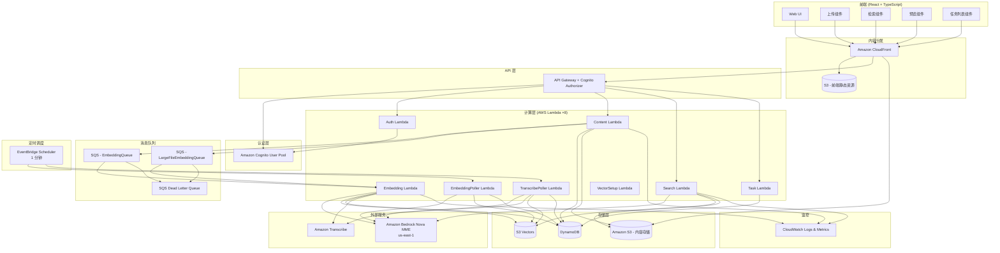
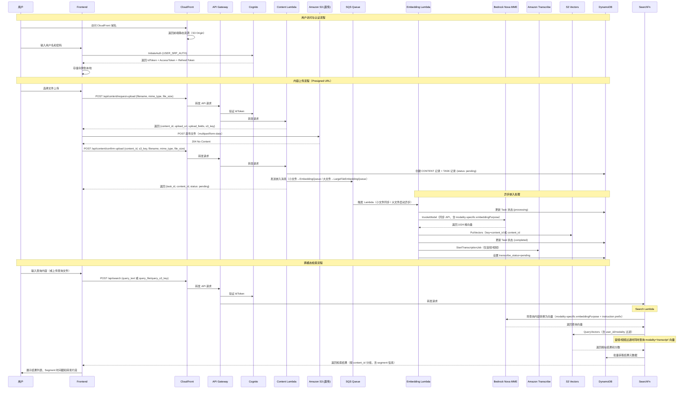

# 技术设计文档：多模态内容检索应用

## 概述

本系统是一个多模态内容检索应用，允许用户上传文本、语音、视频、文档、图片等多种模态内容，利用 Amazon Bedrock Nova MME 模型将内容直接转换为统一的向量嵌入空间，存储到 S3 向量数据库中，并支持跨模态语义检索。

音频和视频内容额外经过 Amazon Transcribe 语音转文字管道，使文本语义查询能够匹配音视频中的口语内容。

### 核心设计决策

1. **Amazon Bedrock Nova MME 直接多模态嵌入**：使用 `amazon.nova-2-multimodal-embeddings-v1:0` 模型，原生支持多模态输入（文本、图片、视频、音频），无需对不同模态进行预处理或转换，直接将原始内容映射到统一的向量空间。支持同步 API（InvokeModel，适用于小文件）和异步 API（StartAsyncInvoke，适用于大文件自动分段嵌入）。
2. **全栈 AWS Serverless 架构**：采用 Lambda（×8）+ API Gateway 替代传统服务器，SQS 替代 Celery + Redis 任务队列，实现完全无服务器化，按需扩展，降低运维成本。
3. **S3 Vector 向量存储**：使用 Amazon S3 Vectors 作为向量数据库，原生支持向量存储和相似度搜索，无需维护 FAISS 索引。原始文件也存储在 S3 中。
4. **Amazon Cognito 认证**：使用 Cognito User Pool 实现用户认证与授权，API Gateway 内置 Cognito Authorizer 进行令牌验证，无需自行管理密码存储和令牌签发。
5. **Amazon CloudFront 统一入口**：使用 CloudFront 作为用户访问的统一入口，分发前端静态资源（React SPA 部署到 S3），同时代理 API Gateway 请求，并用于生成内容预览的签名 URL。
6. **Amazon Transcribe 语音转文字**：音频/视频内容上传后并行触发 Transcribe 任务，转录完成后将文本分段嵌入存入 S3 Vectors，使文本查询能够检索音视频口语内容。
7. **指数退避重试**：对 Bedrock API 调用实施指数退避重试策略，提升系统容错能力。

### 技术栈

| 层级 | 技术选型 | 说明 |
|------|---------|------|
| 前端 | React + TypeScript | SPA 应用，支持多模态内容预览 |
| CDN / 入口 | Amazon CloudFront | 静态资源分发、API 代理、签名 URL |
| API 网关 | Amazon API Gateway (REST) | 请求路由、Cognito 授权、限流 |
| 后端计算 | AWS Lambda (Python) ×8 | 无服务器函数，按需扩展 |
| 任务队列 | Amazon SQS ×2 | 异步任务处理和消息解耦（小文件队列 + 大文件队列） |
| 定时触发 | Amazon EventBridge Scheduler | 1 分钟间隔轮询 Bedrock 异步任务和 Transcribe 任务 |
| 嵌入模型 | Amazon Bedrock Nova MME | 多模态向量嵌入生成（us-east-1） |
| 语音转文字 | Amazon Transcribe | 音频/视频内容语音识别 |
| 向量存储 | Amazon S3 Vectors | 向量存储与相似度搜索 |
| 对象存储 | Amazon S3 | 原始文件存储、嵌入输出、转录结果 |
| 数据库 | Amazon DynamoDB | 任务、内容元数据存储 |
| 认证 | Amazon Cognito | 用户认证与授权 |
| 密钥管理 | AWS Secrets Manager | CloudFront RSA 私钥存储 |
| 日志监控 | Amazon CloudWatch | 日志记录与监控告警 |

## 架构

### 系统架构图




### 请求流程




## 组件与接口

### 1. Auth Service（认证服务 — Cognito 集成）

基于 Amazon Cognito User Pool 实现用户注册、登录、令牌管理。Auth Lambda 作为 Cognito 的薄封装层，处理注册和用户资料查询。API Gateway 使用 Cognito Authorizer 自动验证令牌。

**Cognito User Pool 配置：**
- 登录属性：username + password
- 必填属性：email
- 密码策略：最少 8 位，包含大小写字母、数字和特殊字符
- 令牌有效期：Access Token 24 小时，Refresh Token 30 天
- 认证流程：`USER_SRP_AUTH` / `ALLOW_USER_PASSWORD_AUTH`

**接口定义：**

```python
# POST /api/auth/register
class RegisterRequest:
    username: str
    password: str
    email: str

class RegisterResponse:
    user_id: str  # Cognito sub
    username: str

# POST /api/auth/login
class LoginRequest:
    username: str
    password: str

class LoginResponse:
    id_token: str
    access_token: str
    refresh_token: str
    expires_in: int  # 秒

# GET /api/auth/me
class UserProfile:
    user_id: str  # Cognito sub
    username: str
    email: str
```

**设计要点：**
- 密码由 Cognito 使用 SRP 协议安全存储，无需自行管理密码哈希
- API Gateway Cognito Authorizer 验证 **IdToken**（非 AccessToken），无需在 Lambda 中手动验证
- 请求头格式：`Authorization: <id_token>`（无 "Bearer" 前缀）
- Lambda 通过 `event['requestContext']['authorizer']['claims']` 获取用户信息（`sub` 字段为 user_id）

### 2. Content Service（内容服务 — Content Lambda）

负责文件上传（Presigned URL 流程）、查询文件上传、模态识别、任务创建。作为 Lambda 函数运行，通过 API Gateway 触发。

**接口定义：**

```python
# POST /api/content/request-upload
# Step 1: 生成 S3 预签名上传 URL，前端直传文件到 S3
class RequestUploadRequest:
    filename: str
    mime_type: str
    file_size: int

class RequestUploadResponse:
    content_id: str
    upload_url: str   # S3 presigned POST URL
    upload_fields: dict  # 需随文件一起 POST 的表单字段
    s3_key: str
    expires_in: int  # 3600 秒

# POST /api/content/confirm-upload
# Step 2: 前端上传完成后调用，创建 DynamoDB 记录并触发嵌入
class ConfirmUploadRequest:
    content_id: str
    s3_key: str
    filename: str
    mime_type: str
    file_size: int

class ConfirmUploadResponse:
    task_id: str
    content_id: str
    modality: str
    status: str  # "pending"

# POST /api/content/upload-text
class TextUploadRequest:
    text: str
    title: str  # 可选

class TextUploadResponse:
    task_id: str
    content_id: str
    modality: str  # "text"
    status: str

# POST /api/content/query-upload
# 为大查询文件（>5MB）生成 Presigned URL，目标为 tmp/query/ 临时目录
class QueryUploadRequest:
    filename: str
    mime_type: str
    file_size: int

class QueryUploadResponse:
    upload_url: str
    upload_fields: dict
    s3_key: str  # tmp/query/{user_id}/{uuid}.{ext}

# GET /api/content/{content_id}
class ContentDetail:
    content_id: str
    user_id: str
    modality: str
    filename: str
    file_size: int
    mime_type: str
    s3_key: str
    s3_bucket: str
    is_indexed: bool
    created_at: str  # ISO 8601
    metadata: dict
    # 以下字段仅音频/视频内容包含：
    transcribe_status: str  # "pending" | "completed" | "failed"
    transcribe_job_name: str
    transcript: str  # 完整转录文本，最多 10,000 字符

# GET /api/content/{content_id}/download
# 响应: 包含 download_url（CloudFront 签名 URL 或 S3 预签名 URL）
```

**模态识别逻辑：**

| MIME 类型 | 模态 |
|----------|------|
| `image/png`, `image/jpeg`, `image/webp`, `image/gif` | image |
| `audio/mpeg`, `audio/wav`, `audio/ogg` | audio |
| `video/mp4`, `video/quicktime`, `video/x-matroska`, `video/webm`, `video/x-flv`, `video/mpeg`, `video/x-ms-wmv`, `video/3gpp` | video |
| `application/pdf`, `application/vnd.openxmlformats-officedocument.wordprocessingml.document`, `text/plain` | document |

**文件大小限制（基于 Nova MME 异步 API 限制）：**
- 图片：最大 50MB
- 语音：最大 1GB，最长 2 小时
- 视频：最大 2GB，最长 2 小时
- 文档（文本文件）：最大 634MB
- 文本输入：最大 50,000 字符

**大文件处理：**所有二进制文件上传均通过 S3 Presigned POST URL 直传，不经过 API Gateway（避免 10MB 限制）。流程：`request-upload` → 前端直传 S3 → `confirm-upload`。

**查询文件临时存储：** `tmp/query/` 前缀配置 S3 Lifecycle 1 天自动过期，防止临时查询文件积累。

### 3. Embedding Service（嵌入服务 — Embedding Lambda）

负责调用 Bedrock Nova MME 模型生成向量嵌入。由 SQS 事件源映射触发，异步运行。对音频/视频文件，完成嵌入后并行启动 Amazon Transcribe 转录任务。

**SQS 消息格式：**

```python
class EmbeddingMessage:
    content_id: str
    s3_key: str
    s3_bucket: str
    modality: str
    mime_type: str
    task_id: str
    user_id: str
    file_size: int
    created_at: str
    retry_count: int  # 当前重试次数，默认 0
    text_content: str  # 仅文本内容时内联传递
```

**Bedrock Nova MME 正确调用格式：**

Nova MME 模型 ID：`amazon.nova-2-multimodal-embeddings-v1:0`（区域：us-east-1）

```python
# 同步 API（InvokeModel）— 文本输入
bedrock_runtime.invoke_model(
    modelId="amazon.nova-2-multimodal-embeddings-v1:0",
    body={
        "taskType": "SINGLE_EMBEDDING",
        "singleEmbeddingParams": {
            "embeddingPurpose": "TEXT_INDEX",  # 按模态选择，见下表
            "embeddingDimension": 1024,
            "text": {"value": "文本内容"}
        }
    }
)
# 响应: result["embeddings"][0]["embedding"]  → [float × 1024]

# 同步 API — 图片输入（base64 内联）
{
    "taskType": "SINGLE_EMBEDDING",
    "singleEmbeddingParams": {
        "embeddingPurpose": "IMAGE_INDEX",
        "embeddingDimension": 1024,
        "image": {
            "source": {"bytes": "<base64>"},
            "detailLevel": "STANDARD_IMAGE"
        }
    }
}

# 同步 API — 音频输入（S3 URI）
{
    "taskType": "SINGLE_EMBEDDING",
    "singleEmbeddingParams": {
        "embeddingPurpose": "AUDIO_INDEX",
        "embeddingDimension": 1024,
        "audio": {
            "source": {"s3Location": {"uri": "s3://bucket/key"}},
            "format": "mp3"  # 从 mime_type 派生：audio/mpeg→mp3, audio/wav→wav, audio/ogg→ogg
        }
    }
}

# 异步 API（StartAsyncInvoke）— 大文件分段嵌入（音频/视频 > 30s 或 > 100MB）
bedrock_runtime.start_async_invoke(
    modelId="amazon.nova-2-multimodal-embeddings-v1:0",
    modelInput={
        "taskType": "SEGMENTED_EMBEDDING",
        "segmentedEmbeddingParams": {
            "embeddingPurpose": "AUDIO_INDEX",
            "embeddingDimension": 1024,
            "audio": {
                "source": {"s3Location": {"uri": "s3://bucket/key"}},
                "format": "mp3"
            }
        }
    },
    outputDataConfig={
        "s3OutputDataConfig": {
            "s3Uri": "s3://embeddings-output/{content_id}/"
        }
    }
)
# 输出：S3 上写入 segmented-embedding-result.json（manifest）+ embedding-*.jsonl（JSONL，每行一个 segment）
# JSONL 每行格式：{"embedding": [...1024 floats...], "status": "SUCCESS", "segmentMetadata": {"segmentIndex": 0, ...}}
```

**embeddingPurpose 选择规则：**

| 用途 | embeddingPurpose |
|------|-----------------|
| 索引图片 | `IMAGE_INDEX` |
| 索引音频 | `AUDIO_INDEX` |
| 索引视频 | `VIDEO_INDEX` |
| 索引文本/文档 | `TEXT_INDEX` |
| 检索查询（目标：图片/音频/视频） | `GENERIC_RETRIEVAL` |
| 检索查询（目标：文本/文档） | `TEXT_RETRIEVAL` |
| 文件查询（图片文件） | `IMAGE_RETRIEVAL` |
| 文件查询（音频文件） | `AUDIO_RETRIEVAL` |
| 文件查询（视频文件） | `VIDEO_RETRIEVAL` |
| 转录文本段索引 | `GENERIC_INDEX` |
| 转录文本段查询 | `GENERIC_RETRIEVAL` |

**同步/异步 API 选择逻辑：**

| 模态 | 同步 API 条件 | 异步 API 条件 |
|------|-------------|-------------|
| 文本 | ≤ 50,000 字符 | 不适用（通过文本直接传递） |
| 图片 | 所有图片（≤ 50MB） | 不适用 |
| 音频 | ≤ 30 秒且 ≤ 100MB | > 30 秒或 > 100MB |
| 视频 | ≤ 30 秒且 ≤ 100MB | > 30 秒或 > 100MB |

**Transcribe 任务启动（仅音频/视频）：**

```python
# Embedding Lambda 在完成向量嵌入后调用
transcribe.start_transcription_job(
    TranscriptionJobName=f"tr-{content_id}",
    MediaFormat="mp3",  # 从 mime_type 派生
    Media={"MediaFileUri": f"s3://{bucket}/{s3_key}"},
    OutputBucketName=content_bucket,
    OutputKey=f"transcripts/{user_id}/{content_id}/transcript.json",
    IdentifyLanguage=True,  # 自动识别语言
)
# DynamoDB: transcribe_status=pending, transcribe_job_name="tr-{content_id}"
```

**SQS 配置：**
- **EmbeddingQueue**（小文件同步嵌入）：可见性超时 900 秒，消息保留 14 天，最大接收次数 4，DLQ
- **LargeFileEmbeddingQueue**（大文件异步嵌入启动）：可见性超时 60 秒，消息保留 14 天，最大接收次数 4，DLQ
- 批处理大小：1（每次处理一条消息，避免超时）

**重试策略：**
- SQS 自动重试：消息处理失败后自动重新投递
- Lambda 内部重试：对 Bedrock API 调用实施指数退避（初始 1 秒，退避因子 2，最多 3 次）
- 最终失败：消息转入 DLQ，Task 标记为 failed

### 4. Embedding Poller（嵌入轮询服务 — EmbeddingPoller Lambda）

负责轮询 Bedrock 异步嵌入任务完成状态，收集分段嵌入结果。

**触发方式：** EventBridge Scheduler（每 1 分钟）

**处理逻辑：**
1. 查询 DynamoDB 中 `status=processing` 的 Task 记录
2. 调用 `bedrock-runtime.get_async_invoke(invocationArn=...)` 检查任务状态
3. 任务完成后，读取 S3 manifest（`segmented-embedding-result.json`）获取输出文件 URI 列表
4. 逐个解析 JSONL 文件，提取每个 segment 的嵌入向量和元数据
5. 批量调用 `s3vectors.put_vectors`（每批最多 500 条）存储分段向量：键格式 `{content_id}#seg0`、`#seg1`...
6. 更新 DynamoDB：`is_indexed=true`，Task `status=completed`

### 5. Transcribe Poller（转录轮询服务 — TranscribePoller Lambda）

负责轮询 Transcribe 转录任务完成状态，生成转录文本的向量嵌入并存入 S3 Vectors。

**触发方式：** EventBridge Scheduler（每 1 分钟）

**处理逻辑：**
1. 查询 DynamoDB 中 `transcribe_status=pending` 的音频/视频内容记录
2. 调用 `transcribe.get_transcription_job(TranscriptionJobName=...)` 检查任务状态
3. 任务完成后，从 S3 下载 `transcript.json`，提取完整转录文本
4. 将转录文本按 ~500 字符分段（以句子边界对齐），为每段生成文本嵌入向量（`embed_text_sync`，`GENERIC_INDEX` purpose）
5. 批量存储向量到 S3 Vectors，键格式 `{content_id}#transcript#seg0`、`#transcript#seg1`...，元数据：`{user_id, modality='transcript', content_id}`
6. 更新 DynamoDB：`transcribe_status=completed`，`transcript=<完整文本, max 10k chars>`

**向量键设计（S3 Vectors）：**

| 类型 | 键格式 | 元数据 modality |
|------|--------|----------------|
| 单段嵌入（小文件） | `{content_id}` | audio / video / image / document / text |
| 分段嵌入（大文件，Bedrock 异步） | `{content_id}#seg0`, `#seg1`, ... | audio / video |
| 转录文本段 | `{content_id}#transcript#seg0`, `#transcript#seg1`, ... | transcript |

### 6. Search Service（检索服务 — Search Lambda）

负责将查询内容转换为向量并在 S3 Vectors 中执行相似度搜索，支持跨模态检索和转录文本检索。

**接口定义：**

```python
# POST /api/search
# Authorization: <id_token>
class SearchRequest:
    query_text: str          # 文本查询（与 query_file/query_s3_key 三选一）
    query_file: str          # 文件查询（base64 编码，≤5MB）
    query_file_type: str     # 文件 MIME 类型（query_file 时必填）
    query_s3_key: str        # S3 Key（>5MB 文件走 presigned upload 后传此参数）
    top_k: int               # 默认 10，范围 1-100
    modality_filter: list[str]  # 可选，按模态过滤结果

class SegmentInfo:
    segment_index: int
    similarity_score: float
    time_offset_seconds: float  # 该 Segment 在媒体文件中的起始时间（秒）
    duration_seconds: float     # 该 Segment 的时长（秒）
    is_transcript: bool         # True = 来自转录文本匹配；False = 来自音视频嵌入匹配
    transcript_text: str        # 匹配的转录文本片段（is_transcript=True 时非空）

class SearchResult:
    content_id: str
    similarity_score: float  # 最佳 Segment 的分数
    modality: str
    filename: str
    file_size: int
    download_url: str        # S3 预签名 URL 或 CloudFront 签名 URL
    created_at: str
    segments: list[SegmentInfo]  # 最多 3 个最佳匹配 Segment；非分段内容为 null
    transcribe_status: str   # 仅音频/视频内容包含

class SearchResponse:
    results: list[SearchResult]
    total: int
    query_time_ms: int
```

**搜索处理逻辑：**

1. **查询嵌入生成**：根据查询来源（文本/文件/S3 Key）和目标模态选择 `embeddingPurpose`；文本查询自动添加 instruction prefix：
   - 目标为图片/音频/视频：`"Instruction: Find an image, video or document that matches the following description:\nQuery: {text}"`，purpose=`GENERIC_RETRIEVAL`
   - 目标为文本/文档：`"Instruction: Given a query, retrieve passages that are relevant to the query:\nQuery: {text}"`，purpose=`TEXT_RETRIEVAL`
   - 图片文件查询：purpose=`IMAGE_RETRIEVAL`
   - 音频文件查询：purpose=`AUDIO_RETRIEVAL`
   - 视频文件查询：purpose=`VIDEO_RETRIEVAL`

2. **向量检索**：调用 S3 Vectors `query_vectors`，过滤条件为 `{user_id: $eq, modality: $eq}`；当 `modality_filter` 包含 audio 或 video 时，额外发起一次 `modality='transcript'` 向量查询，合并结果

3. **结果分组去重**：按 `content_id` 分组（从向量键中提取，以 `#` 分割取首段），每个内容项最多保留 3 个相似度最高的 Segment

4. **元数据填充**：批量从 DynamoDB 获取 CONTENT 记录，填充 filename、modality、transcribe_status 等字段；生成下载 URL

5. **`query_s3_key` 处理**：从 S3 读取临时查询文件内容，生成嵌入向量后，删除 S3 对象（`s3.delete_object`）

**S3 Vectors 过滤语法：**

```json
{
  "filter": {
    "$and": [
      {"user_id": {"$eq": "abc123"}},
      {"modality": {"$eq": "audio"}}
    ]
  }
}
```

### 7. Task Service（任务服务 — Task Lambda）

负责任务状态管理和查询。

**接口定义：**

```python
# GET /api/tasks
# 查询参数: status, limit (默认20, 最大100), next_token
class TaskListResponse:
    tasks: list[TaskSummary]
    count: int
    next_token: str  # 分页 token，无更多结果时为 null

class TaskSummary:
    task_id: str
    content_id: str
    filename: str        # 通过 batch_get_item 从 CONTENT 记录获取
    task_type: str       # "upload"
    modality: str
    status: str          # "pending" | "processing" | "completed" | "failed"
    created_at: str
    updated_at: str
    error_message: str   # 可选

# GET /api/tasks/{task_id}
class TaskDetail(TaskSummary):
    pass  # 同 TaskSummary，通过 GSI1 按 task_id 查询
```

### 8. Vector Setup Service（向量存储初始化 — VectorSetup Lambda）

**触发方式：** CloudFormation Custom Resource（栈创建/删除时触发）

**职责：** 创建 S3 Vectors 桶（`multimodal-retrieval-{env}-vectors-{env}`）和索引（`content-embeddings`，1024 维，cosine 距离），并配置 filterable metadata（默认所有未在 `nonFilterableMetadataKeys` 中的字段均可过滤）。


## 数据模型

### DynamoDB 表设计

本系统使用 DynamoDB 单表设计（Single Table Design），通过分区键（PK）和排序键（SK）的组合支持多种访问模式。

#### 表结构：`MultimodalContentTable`

| 属性 | 类型 | 说明 |
|------|------|------|
| PK | String | 分区键，格式见下方访问模式 |
| SK | String | 排序键，格式见下方访问模式 |
| GSI1PK | String | GSI1 分区键 |
| GSI1SK | String | GSI1 排序键 |
| entity_type | String | 实体类型：USER / CONTENT / TASK |
| data | Map | 实体具体属性 |

#### 实体与键设计

**User 实体：**
| 键 | 值 | 说明 |
|----|-----|------|
| PK | `USER#{user_id}` | Cognito sub |
| SK | `PROFILE` | 固定值 |
| data | `{username, email, created_at}` | 用户基本信息 |

**Content 实体：**
| 键 | 值 | 说明 |
|----|-----|------|
| PK | `USER#{user_id}` | 所属用户 |
| SK | `CONTENT#{content_id}` | 内容 ID |
| GSI1PK | `CONTENT#{content_id}` | 用于按 content_id 直接查询 |
| GSI1SK | `METADATA` | 固定值 |
| data | 见下方字段说明 | 内容元数据 |

**Content data 字段：**
```
{
  filename, mime_type, modality, file_size,
  s3_key, s3_bucket,
  is_indexed: bool,
  created_at: ISO8601,
  // 音频/视频专有（Transcribe 管道写入）:
  transcribe_status: "pending" | "completed" | "failed",
  transcribe_job_name: str,
  transcript: str  // 完整转录文本，最多 10,000 字符
}
```

**Task 实体：**
| 键 | 值 | 说明 |
|----|-----|------|
| PK | `USER#{user_id}` | 所属用户 |
| SK | `TASK#{created_at}#{task_id}` | 按创建时间排序 |
| GSI1PK | `TASK#{task_id}` | 用于按 task_id 直接查询 |
| GSI1SK | `DETAIL` | 固定值 |
| data | `{task_id, content_id, modality, filename, status, error_message?, created_at, updated_at}` | 任务详情 |

#### GSI（全局二级索引）

**GSI1：** 支持按 content_id 或 task_id 直接查询
- 分区键：GSI1PK
- 排序键：GSI1SK

#### 访问模式

| 访问模式 | 键条件 | 说明 |
|---------|--------|------|
| 获取用户资料 | PK=`USER#{user_id}`, SK=`PROFILE` | 单项查询 |
| 获取用户所有内容 | PK=`USER#{user_id}`, SK begins_with `CONTENT#` | 查询用户上传的所有内容 |
| 获取用户所有任务 | PK=`USER#{user_id}`, SK begins_with `TASK#` | 按时间排序的任务列表 |
| 按 task_id 查询任务 | GSI1PK=`TASK#{task_id}` | 通过 GSI1 查询 |
| 按 content_id 查询内容 | GSI1PK=`CONTENT#{content_id}` | 通过 GSI1 查询 |
| 按转录状态查询内容 | 扫描 + filter `transcribe_status=pending` | TranscribePoller 轮询使用 |
| 按状态筛选任务 | PK=`USER#{user_id}`, SK begins_with `TASK#`, filter status | 查询后过滤 |

### S3 存储结构

```
s3://{content-bucket}/
├── uploads/                        # 原始上传文件
│   └── {user_id}/
│       └── {content_id}/{filename}
├── embeddings-output/              # Bedrock 异步 API 嵌入输出
│   └── {content_id}/{invocation_id}/
│       ├── segmented-embedding-result.json   # manifest（输出文件 URI 列表）
│       └── embedding-*.jsonl                 # JSONL 分段嵌入（每行一个 segment）
├── transcripts/                    # Amazon Transcribe 转录结果
│   └── {user_id}/
│       └── {content_id}/transcript.json
└── tmp/
    └── query/                      # 大查询文件临时上传（S3 Lifecycle 1 天自动过期）
        └── {user_id}/{uuid}.{ext}

s3://{frontend-bucket}/             # 前端静态资源（CloudFront Origin）
├── index.html
└── static/
    ├── js/
    └── css/
```

### CloudFront 配置

- **分发域名**：用户通过 CloudFront 域名访问整个应用
- **Origin 1 - 前端静态资源**：S3 桶 `{frontend-bucket}`，使用 OAC（Origin Access Control）限制直接访问
- **Origin 2 - API 代理**：API Gateway 端点，路径模式 `/api/*` 转发到 API Gateway；禁用缓存，转发所有请求头
- **Origin 3 - 内容预览**：S3 桶 `{content-bucket}`，路径模式 `/content/*`；通过 CloudFront Function 重写路径（去除 `/content` 前缀）
- **内容下载 URL**：优先使用 CloudFront 签名 URL（RSA 私钥存储于 Secrets Manager）；未配置时降级为 S3 预签名 URL（15 分钟有效期）
- **S3 加密**：内容桶使用 `AES256`（SSE-S3），确保 Transcribe 服务和 CloudFront OAC 均可访问

### S3 Vectors 配置

- **向量桶名称**：`multimodal-retrieval-{env}-vectors-{env}`（us-west-2）
- **向量索引名称**：`content-embeddings`
- **向量维度**：1024（Nova MME 输出维度）
- **距离度量**：cosine similarity
- **可过滤元数据字段**：`user_id`、`modality`、`content_id`

**向量键格式（三种）：**

| 类型 | 键格式 | 元数据 modality 值 | 说明 |
|------|--------|-------------------|------|
| 单段嵌入 | `{content_id}` | audio/video/image/document/text | 小文件同步嵌入 |
| Bedrock 分段嵌入 | `{content_id}#seg{N}` | audio/video | 大文件异步嵌入 |
| 转录文本段 | `{content_id}#transcript#seg{N}` | transcript | Transcribe 管道生成 |

**示例查询过滤（音频 + 转录）：**

```json
// 查询音频嵌入向量
{"filter": {"$and": [{"user_id": {"$eq": "abc"}}, {"modality": {"$eq": "audio"}}]}}

// 查询转录文本向量（音频/视频内容的语音转文字）
{"filter": {"$and": [{"user_id": {"$eq": "abc"}}, {"modality": {"$eq": "transcript"}}]}}
```

S3 Vectors 支持 API：`put_vectors`（批量最多 500 条）、`query_vectors`（Top-K 相似度搜索）、`get_vectors`、`delete_vectors`。


## 正确性属性

*属性是在系统所有有效执行中都应保持为真的特征或行为——本质上是关于系统应该做什么的形式化陈述。属性是人类可读规范与机器可验证正确性保证之间的桥梁。*

### Property 1: 未认证请求被拒绝

*For any* API 请求，如果请求未携带有效的 Cognito IdToken（缺失、过期或无效），则 API Gateway Cognito Authorizer 应返回 401 状态码，拒绝访问受保护的端点。

**Validates: Requirements 1.1, 1.5**

### Property 2: 有效凭据认证往返

*For any* 有效的用户名和密码组合，通过 Cognito 注册后使用相同凭据调用 InitiateAuth，应返回包含 id_token、access_token 和 refresh_token 的认证响应，且 id_token 可被 API Gateway Cognito Authorizer 成功验证。

**Validates: Requirements 1.2**

### Property 3: 无效凭据被拒绝

*For any* 无效的凭据（错误密码或不存在的用户名），Cognito InitiateAuth 应返回 NotAuthorizedException 错误，且响应中不包含认证令牌。

**Validates: Requirements 1.3**

### Property 4: 文件模态正确识别

*For any* 支持的文件 MIME 类型，系统的模态识别函数应返回正确的模态分类（image、audio、video、document、text）。

**Validates: Requirements 2.2**

### Property 5: 上传创建任务

*For any* 有效的上传请求（支持的文件格式且未超过大小限制），Content Lambda 应在 DynamoDB 中创建 Task 记录和 Content 记录，返回有效的 task_id，且 DynamoDB 中存在对应的记录。

**Validates: Requirements 2.4**

### Property 6: 文件格式验证

*For any* 文件上传请求，如果文件的 MIME 类型在支持列表中，则上传应被接受；如果不在支持列表中，则应返回错误信息并列出支持的格式。

**Validates: Requirements 2.5, 2.6**

### Property 7: 文件大小限制

*For any* 文件上传请求，如果文件大小超过该模态的大小限制，系统应拒绝上传并返回包含大小限制信息的错误消息。

**Validates: Requirements 2.7**

### Property 8: 嵌入生成与存储往返

*For any* 成功上传的内容，Embedding Lambda 应调用 Nova MME 模型生成向量嵌入，将嵌入存储到 S3 Vectors 中，且通过 content_id 可以从 S3 Vectors 检索到对应的嵌入向量，同时 DynamoDB 中的元数据包含原始文件的 S3 路径。

**Validates: Requirements 3.1, 3.2, 3.3, 3.4**

### Property 9: 嵌入失败标记任务

*For any* 嵌入生成过程中发生的错误（包括 Lambda 内部重试 3 次后仍失败，以及 SQS 消息最终转入 DLQ 的情况），系统应将对应的 Task 状态标记为 "failed"，且 error_message 字段非空。

**Validates: Requirements 3.5, 7.2**

### Property 10: 检索结果正确性

*For any* 检索请求和指定的 Top-K 值，返回的结果数量应 <= K，结果应按相似度分数严格降序排列，且每个结果应包含 content_id、similarity_score、modality、filename、download_url 和 created_at 字段。

**Validates: Requirements 4.3, 4.4, 4.5, 4.6**

### Property 11: 任务用户隔离

*For any* 用户查询任务列表，DynamoDB 查询使用 PK=`USER#{user_id}` 作为分区键，返回的所有任务应仅属于该用户，不包含其他用户的任务。

**Validates: Requirements 5.1**

### Property 12: 任务数据完整性

*For any* Task 记录，其 status 字段应为 "pending"、"processing"、"completed"、"failed" 四种有效状态之一，且应包含 task_type、modality、created_at、status 字段。已完成的任务应包含 result_summary。

**Validates: Requirements 5.2, 5.4, 5.6**

### Property 13: 任务状态变更时间戳

*For any* Task 状态变更操作，变更后的 updated_at 时间戳应大于等于变更前的 updated_at 值。

**Validates: Requirements 5.3**

### Property 14: 任务状态筛选

*For any* 状态筛选条件，返回的任务列表中所有任务的 status 字段应与筛选条件匹配。

**Validates: Requirements 5.5**

### Property 15: 内容下载 URL 有效性

*For any* 已索引的内容，下载端点应返回有效的签名 URL（CloudFront 或 S3 预签名），该 URL 指向正确的原始文件。

**Validates: Requirements 6.7**

### Property 16: 重试与指数退避

*For any* Bedrock API 调用失败，Embedding Lambda 应自动重试最多 3 次，且重试间隔应遵循指数退避策略（每次间隔 >= 前一次间隔的 2 倍）。

**Validates: Requirements 7.1**

### Property 17: S3 Vectors 不可用时的降级处理

*For any* S3 Vectors 不可用的情况，嵌入数据应被写入 SQS 死信队列而非丢失，待 S3 Vectors 恢复后可从 DLQ 中重新处理。

**Validates: Requirements 7.4**

### Property 18: 错误日志完整性

*For any* 系统错误，CloudWatch 错误日志应包含时间戳、错误类型和请求上下文信息（包括 request_id、user_id、Lambda 函数名）三个必要字段。

**Validates: Requirements 7.5**

### Property 19: 错误响应安全性

*For any* 服务端错误（5xx），API Gateway 返回给客户端的错误响应不应包含堆栈跟踪、内部错误详情或敏感的技术信息。

**Validates: Requirements 7.6**

### Property 20: 任务隔离性

*For any* 两个不同用户同时提交的任务（通过不同的 SQS 消息独立处理），一个 Lambda 实例的处理失败不应导致另一个 Lambda 实例的任务失败或状态异常。

**Validates: Requirements 8.3**

### Property 21: API 速率限制

*For any* 时间窗口内的 Bedrock API 调用，Embedding Lambda 中的调用次数不应超过配置的速率限制阈值。

**Validates: Requirements 8.4**

### Property 22: 音频/视频嵌入后触发 Transcribe

*For any* 音频或视频内容成功完成向量嵌入，Embedding Lambda 应启动一个 Amazon Transcribe 转录任务，并在对应的 DynamoDB Content 记录中将 `transcribe_status` 设置为 "pending"，`transcribe_job_name` 设置为有效的任务名称。

**Validates: Requirements 3.7, 9.1**

### Property 23: 转录完成后生成文本嵌入

*For any* Transcribe 任务成功完成，TranscribePoller Lambda 应下载转录文本，将其分段后为每段生成文本嵌入向量，存储到 S3 Vectors（键格式 `{content_id}#transcript#seg{N}`），并将 DynamoDB Content 记录的 `transcribe_status` 更新为 "completed"，`transcript` 字段包含完整转录文本（不超过 10,000 字符）。

**Validates: Requirements 9.2, 9.3, 9.4**

### Property 24: 音频/视频搜索包含转录向量

*For any* 以 `modality_filter=["audio"]` 或 `["video"]` 为条件的搜索请求，Search Lambda 应同时查询对应的音视频嵌入向量和 `modality='transcript'` 转录向量，且返回结果中可能包含 `is_transcript=true` 的 Segment。

**Validates: Requirements 4.8 (transcript), 9.5**

### Property 25: Segment 级别结果分组

*For any* 音频或视频内容被检索到时（无论是音视频嵌入匹配还是转录文本匹配），检索结果中该内容的 `segments` 数组应包含至多 3 个相似度最高的 Segment，且各 Segment 的 `similarity_score` 应严格降序排列。

**Validates: Requirements 4.8**

### Property 26: 查询文件 S3 临时存储与清理

*For any* 通过 `query_s3_key` 参数提交的检索请求，Search Lambda 应在生成查询嵌入后删除 S3 临时文件（`s3.delete_object`），确保临时查询文件不会长期保留。

**Validates: Requirements 10.3**

### Property 27: 转录失败不影响嵌入搜索

*For any* Transcribe 任务失败（`transcribe_status=failed`），对应音视频内容的向量嵌入应已存储在 S3 Vectors 中，且该内容仍可通过音视频嵌入匹配出现在搜索结果中（`is_transcript=false` 的 Segment）。

**Validates: Requirements 9.8**


## 错误处理

### 错误分类与处理策略

| 错误类别 | 示例 | 处理策略 | HTTP 状态码 |
|---------|------|---------|------------|
| 认证错误 | Cognito IdToken 过期、无效令牌 | API Gateway Cognito Authorizer 自动拒绝，返回 401 | 401 |
| 输入验证错误 | 不支持的文件格式、文件过大 | Lambda 返回详细的验证错误信息 | 400 |
| 资源未找到 | 任务不存在、内容不存在 | Lambda 查询 DynamoDB 无结果，返回 404 | 404 |
| 权限错误 | 访问其他用户的任务 | Lambda 校验 PK 中的 user_id 与请求者不匹配 | 403 |
| 外部服务错误 | Bedrock API 失败 | Lambda 内部指数退避重试，最终失败则消息转入 SQS DLQ | 502 |
| 存储服务错误 | S3 不可用、S3 Vectors 不可用 | 消息保留在 SQS 中等待重试，最终转入 DLQ | 503 |
| Lambda 超时 | 嵌入生成超过 Lambda 最大执行时间 | SQS 可见性超时后自动重新投递消息 | 504 |
| 内部错误 | 未预期的异常 | CloudWatch 记录日志，API Gateway 返回通用错误信息 | 500 |

### 错误响应格式

```python
class ErrorResponse:
    error_code: str       # 机器可读的错误代码，如 "INVALID_FILE_FORMAT"
    message: str          # 用户友好的错误描述
    details: dict | None  # 可选的额外信息（如支持的格式列表）
    request_id: str       # API Gateway 请求 ID，用于追踪
```

### 重试策略详细设计

**Lambda 内部重试（Bedrock API 调用）：**

```python
class RetryConfig:
    max_retries: int = 3
    initial_delay_seconds: float = 1.0
    backoff_factor: float = 2.0
    max_delay_seconds: float = 30.0
    retryable_exceptions: list = [
        "ThrottlingException",
        "ServiceUnavailableException",
        "ConnectionError",
        "TimeoutError"
    ]
```

重试流程：
1. 第 1 次重试：等待 1 秒
2. 第 2 次重试：等待 2 秒
3. 第 3 次重试：等待 4 秒
4. 3 次重试后仍失败：Lambda 抛出异常，SQS 消息变为可见并重新投递

**SQS 级别重试：**
- EmbeddingQueue 可见性超时：900 秒（匹配 Lambda 最大执行时间）
- LargeFileEmbeddingQueue 可见性超时：60 秒（仅需启动异步任务，速度快）
- 最大接收次数：4（含首次处理）
- 超过最大接收次数后，消息自动转入死信队列（DLQ）
- DLQ 消息保留期：14 天，支持手动或自动重新处理

### 降级策略

- **S3 Vectors 不可用**：Embedding Lambda 处理失败，消息留在 SQS 中等待重试，最终转入 DLQ。
- **S3 上传失败**：Content Lambda 返回错误给用户，建议稍后重试。S3 Presigned POST 支持重新获取新 URL。
- **Bedrock 异步 API 超时**：EmbeddingPoller 通过 `GetAsyncInvoke` 轮询状态，超时后标记 Task 为 failed。
- **Transcribe 任务失败**：TranscribePoller 将 `transcribe_status` 标记为 failed，不影响音视频嵌入搜索。
- **Bedrock API 限流**：Lambda 内部指数退避重试。SQS 天然支持流量削峰。
- **DynamoDB 限流**：使用 DynamoDB 按需容量模式（On-Demand），自动适应流量变化。

## 测试策略

### 双重测试方法

本项目采用单元测试和属性测试相结合的双重测试策略：

- **单元测试**：验证特定示例、边界情况和错误条件
- **属性测试**：验证跨所有输入的通用属性

两者互补，共同提供全面的测试覆盖。

### 属性测试配置

- **测试库**：Python `hypothesis` 库
- **最小迭代次数**：每个属性测试至少 100 次迭代
- **标签格式**：`Feature: multimodal-content-retrieval, Property {number}: {property_text}`
- **每个正确性属性由一个属性测试实现**

### Serverless 测试策略

由于采用 AWS Serverless 架构，测试策略需要适配：

**本地测试：**
- 使用 `moto` 库模拟 AWS 服务（DynamoDB、S3、SQS、Cognito）
- Lambda 函数的 handler 逻辑可直接在本地调用测试
- 业务逻辑与 AWS SDK 调用分离，便于单元测试

**集成测试：**
- 使用 AWS SAM Local 或 LocalStack 进行本地集成测试
- 对 Bedrock API 和 Transcribe API 使用 mock，避免产生费用
- DynamoDB Local 用于数据模型验证

### 单元测试范围

| 测试类别 | 覆盖内容 |
|---------|---------|
| 认证测试 | Cognito 注册/登录流程（moto mock）、令牌验证、过期处理 |
| 上传测试 | 文件格式验证（含 Nova MME 支持的所有格式）、大小限制、模态识别、DynamoDB 记录创建、Presigned URL 生成 |
| 嵌入测试 | Bedrock 同步/异步 API 调用（mock）、正确 API 格式（SINGLE_EMBEDDING/SEGMENTED_EMBEDDING）、embeddingPurpose 选择逻辑、S3 Vectors 存储、SQS 消息处理、异步任务状态轮询、Transcribe 任务启动 |
| 转录测试 | TranscribePoller 状态轮询、文本分段逻辑、转录文本嵌入生成、S3 Vectors 存储（transcript 键格式）、DynamoDB 状态更新 |
| 检索测试 | 相似度搜索（mock S3 Vectors）、结果排序、Top-K 限制、Segment 分组去重（最多 3 个）、转录向量合并查询、instruction prefix 添加、query_s3_key 处理与删除 |
| 任务测试 | DynamoDB 状态流转、用户隔离（PK 分区）、筛选过滤、filename batch 填充 |
| 错误处理测试 | 重试逻辑、DLQ 降级、错误响应格式、CloudWatch 日志格式 |

### 属性测试范围

每个设计文档中的正确性属性（Property 1-27）对应一个属性测试。关键属性测试示例：

```python
from hypothesis import given, strategies as st, settings

# Feature: multimodal-content-retrieval, Property 4: 文件模态正确识别
@settings(max_examples=100)
@given(mime_type=st.sampled_from(SUPPORTED_MIME_TYPES))
def test_modality_detection_correct(mime_type):
    """对于任何支持的 MIME 类型，模态识别应返回正确分类"""
    expected = MIME_TO_MODALITY[mime_type]
    assert detect_modality(mime_type) == expected

# Feature: multimodal-content-retrieval, Property 6: 文件格式验证
@settings(max_examples=100)
@given(mime_type=st.text(min_size=1))
def test_unsupported_format_rejected(mime_type):
    """对于任何不在支持列表中的 MIME 类型，应被拒绝"""
    if mime_type not in SUPPORTED_MIME_TYPES:
        result = validate_file_format(mime_type)
        assert result.is_error
        assert "supported formats" in result.message.lower()

# Feature: multimodal-content-retrieval, Property 10: 检索结果正确性
@settings(max_examples=100)
@given(top_k=st.integers(min_value=1, max_value=100))
def test_search_results_ordered_and_bounded(top_k):
    """对于任何 Top-K 值，结果应 <= K 且按相似度降序"""
    results = search_handler(mock_query_vector, top_k=top_k)
    assert len(results) <= top_k
    scores = [r["similarity_score"] for r in results]
    assert scores == sorted(scores, reverse=True)

# Feature: multimodal-content-retrieval, Property 12: 任务数据完整性
@settings(max_examples=100)
@given(status=st.sampled_from(["pending", "processing", "completed", "failed"]))
def test_task_status_validity(status):
    """对于任何 Task 记录，status 应为四种有效状态之一"""
    task = create_task(status=status)
    assert task["data"]["status"] in {"pending", "processing", "completed", "failed"}
    assert "task_type" in task["data"]
    assert "modality" in task["data"]
    assert "created_at" in task["data"]

# Feature: multimodal-content-retrieval, Property 25: Segment 级别结果分组
@settings(max_examples=100)
@given(num_segments=st.integers(min_value=1, max_value=20))
def test_segment_grouping_max_three(num_segments):
    """对于任何数量的 Segment，每个内容项最多返回 3 个"""
    mock_results = [{"key": f"content1#seg{i}", "score": 1.0 - i * 0.05}
                    for i in range(num_segments)]
    grouped = group_by_content_id(mock_results, max_segments=3)
    assert len(grouped["content1"]["segments"]) <= 3
```

### 集成测试

- 端到端上传-嵌入-检索流程测试（使用 moto 模拟 AWS 服务）
- Bedrock 同步 API 和异步 API 集成测试（使用真实 API，限制调用频率）
- 异步嵌入任务状态轮询与结果收集测试（EmbeddingPoller）
- Transcribe 任务启动、轮询、文本分段嵌入完整流程测试（TranscribePoller）
- S3 Vectors 存储与检索测试（含 transcript 模态向量）
- SQS 消息流转测试（EmbeddingQueue + LargeFileEmbeddingQueue → Lambda 触发 → DLQ 降级）
- DynamoDB 访问模式验证（单表设计的各种查询模式）
- Cognito 认证流程集成测试（IdToken 验证）
- API Gateway + Lambda 端到端测试（使用 SAM Local）
- CloudFront 分发配置验证（静态资源、API 代理、签名 URL）
- 查询文件 Presigned Upload 流程测试（query-upload → S3 → query_s3_key → 检索 → S3 删除）
